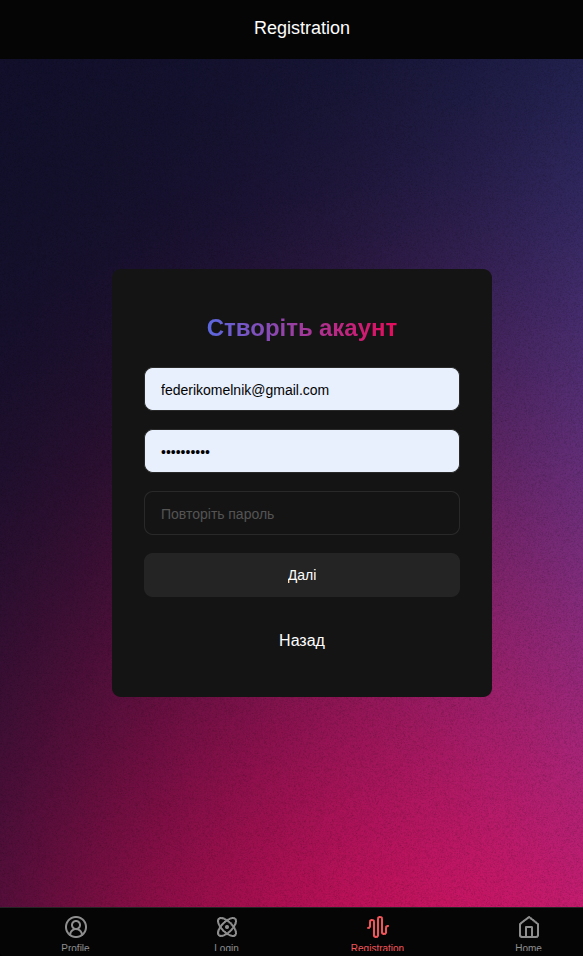
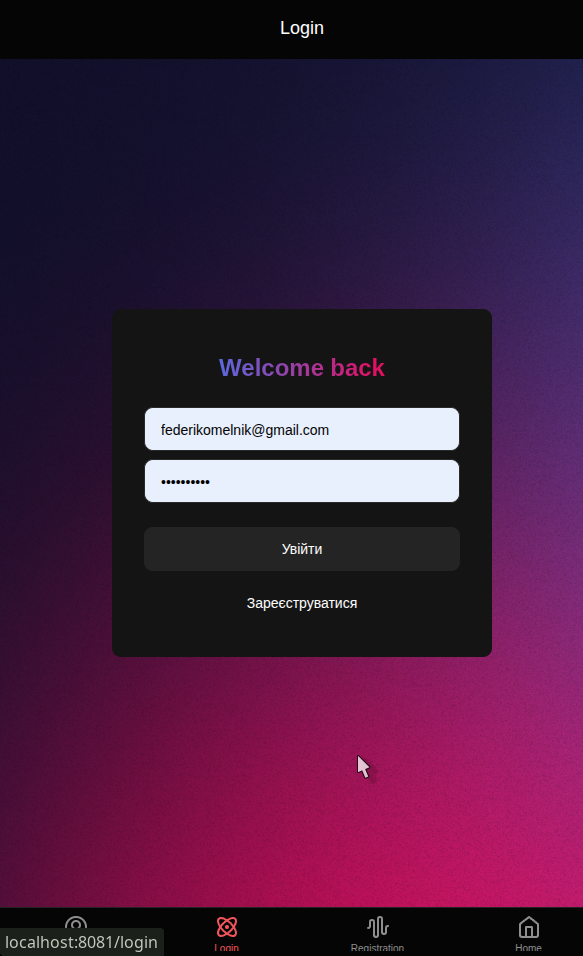
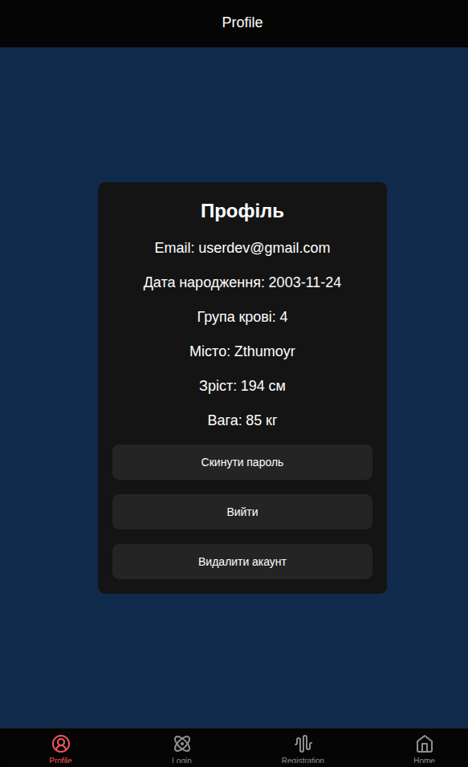

How to start

Fist clone repo

```bash
git clone https://github.com/trusthemind/MobileLabsRN2025.git
```

After run the installation with `yarn`

```bash
yarn
```

after start the project with command

```bash
yarn start
```
